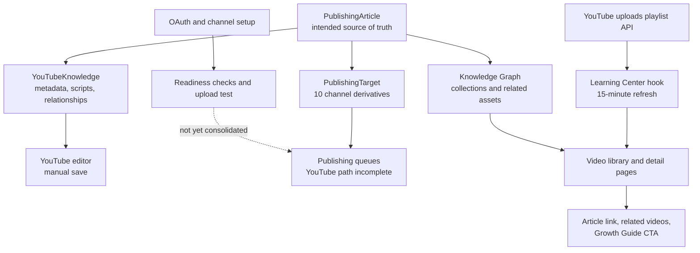

# NTA YouTube Learning System Audit

**Date:** July 29, 2026  
**Repository:** `newtechad1-cyber/new-tech-advertising`  
**Audited branch:** `main` at `ecbc908c52ed19c500b589667e7abf1af965d603`  
**Scope:** Repository architecture and implementation only. Runtime Base44 records, environment secrets, live OAuth status, YouTube Studio playlists, and YouTube Analytics were not changed or assumed to be complete.

## Executive conclusion

NTA already has the foundation of a YouTube learning system. It should be completed and consolidated, not replaced.

The repository contains:

- a documented P-001 Publishing Engine and Y-001 YouTube Knowledge Engine;
- `PublishingArticle` as the intended canonical knowledge source;
- channel-specific `PublishingTarget` records;
- a dedicated `YouTubeKnowledge` model and editor;
- a Knowledge Graph with article, lesson, service, case-study, collection, and video relationships;
- a public Learning Center that reads the YouTube uploads playlist every 15 minutes;
- website video detail pages, embeds, related-video navigation, article links, and `VideoObject` structured data;
- YouTube OAuth scopes, channel discovery, readiness checks, and an admin-only resumable upload test;
- 13 seeded YouTube records and numerous existing website embeds.

The main weakness is fragmentation. Several systems describe or handle YouTube independently, and they are not yet joined into one reliable lifecycle. The public Learning Center sync works from YouTube to the website, while the Publishing Engine stores richer editorial data separately. General queue publishing still reports YouTube as unimplemented, even though an isolated upload test can upload an unlisted MP4. RSS is represented as a publishing target but no repository implementation of a public RSS feed was found.

## Verified current architecture

### Canonical content and relationships

`base44/entities/PublishingArticle.jsonc` is explicitly documented as the single source of truth. It stores:

- canonical ID, slug, canonical URL, asset type, content type, themes, tags, search intent, scores, and buyer stage;
- collection membership;
- related articles, lessons, videos, services, case studies, industries, and geographies;
- video presence and embedded video URL;
- CTA text and URL;
- selected publishing channels and workflow status.

`src/lib/knowledgeGraph.js` loads `PublishingArticle`, `CanonCollection`, `YouTubeKnowledge`, and `JournalIssue`. It provides seed fallback, relationship resolution, reader journeys, homepage feeds, and health metrics.

This is the correct foundation for the long-term “one idea, many connected assets” model.

### Publishing Engine

P-001 defines:

`Draft → Review → Approved → Queued → Published`

Approval or queueing creates `PublishingTarget` records for selected channels. YouTube and RSS are already included among the ten supported target types.

The Publishing Article screen includes a YouTube tab. It loads or creates a `YouTubeKnowledge` record related by `related_journal_id`. The editor supports:

- video title and description;
- category, visibility, tags, URL, and status;
- long-form and Shorts scripts;
- Shorts hook;
- thumbnail URL and prompt;
- related Journal URL, services, case studies, and audit;
- transcript;
- one playlist selection.

The current save is manual. It does not automatically generate the record from an approved article, upload a video, update the parent `PublishingArticle`, create reciprocal links, add a YouTube playlist item, or update the YouTube channel target.

### Website synchronization

The strongest working automation is the public Learning Center sync:

1. `getYouTubePlaylist` calls the YouTube Data API using `YOUTUBE_API_KEY`.
2. It reads up to 50 videos from `YOUTUBE_PLAYLIST_ID`, defaulting to the channel uploads playlist.
3. It fetches video metadata and duration.
4. `useLearningContent` refreshes and caches the result every 15 minutes.
5. It matches YouTube results to `LEARNING_CONTENT` by slug or YouTube video ID.
6. Published YouTube videos and locally planned videos are merged into the public library.
7. Video detail pages embed the video, expose the description, link to a local article when matched, show related videos, and lead to a Growth Guide/Gap Audit CTA.

This is useful and should be retained. Its limitation is that matching relies on mutable video titles/slugs or manually repeated IDs in a separate hardcoded file.

### Existing videos and embeds

The Canon seed contains 13 `YouTubeKnowledge` records with a video ID, URL, status, playlist label, and related page title. Canon articles also carry `has_video`, `video_url`, and `related_video_ids`.

The repository contains many direct YouTube embeds across public pages and components. Several article pages embed their paired lesson video directly. These embeds are working assets, but the IDs and relationships are repeated in multiple locations.

### Playlists

The formal `YouTubeKnowledge` schema and editor define eight playlist labels:

- Start Here
- NTA Journal
- Marketing Lessons
- AI Explained
- Business Growth
- Website Strategy
- Local Business
- Case Studies

Seed video records use additional labels not accepted by that schema:

- NTA Principles
- Building Trust
- Building Better Businesses
- Future of Marketing
- Services

No code was found that resolves a playlist label to a YouTube playlist ID or calls the YouTube API to insert a video into a playlist. At present, playlist assignment is primarily editorial metadata.

### OAuth, YouTube API, and upload state

There are at least two connection approaches:

1. `channelOAuthStart` requests `youtube.upload` and `youtube.readonly`, stores an offline-capable OAuth connection, and can discover available channels.
2. `youtubeConnectionSetup` reads access tokens and a channel ID from environment secrets, verifies scopes and channel access, calculates readiness, and stores a `YouTubeConnectionProfile`.

There is also an admin-only `youtubeUploadTest` function that:

- loads a stored `SocialAccount`;
- refreshes its Google access token;
- downloads a public MP4;
- performs a resumable upload;
- publishes the test as unlisted;
- returns the YouTube video ID and URL.

This proves that a real upload path exists in isolation. It is not yet connected to `YouTubeKnowledge`, `PublishingTarget`, the normal approval workflow, playlist insertion, thumbnails, captions, or reciprocal website updates.

Other paths remain incomplete:

- `publishQueueItem` requires a YouTube destination but has no YouTube provider publisher;
- `videoPublishingAgent.publishYoutube` deliberately blocks the job;
- `schoolVideoPublishYoutube` returns a fabricated example URL;
- `schoolPublishingDispatcher` returns placeholder IDs and URLs.

The placeholder school-video functions are a separate subsystem and must not be mistaken for working NTA YouTube publishing.

### Metadata and discoverability

Existing metadata strengths include:

- canonical article IDs and URLs;
- search and AI-search intent;
- tags and themes;
- video title, description, transcript, tags, thumbnail, category, visibility, status, and duration;
- relationship metadata;
- public `VideoObject` structured data;
- YouTube descriptions shown on website video pages;
- article and Growth Guide links from the video detail experience.

Gaps include:

- no stable canonical asset ID shared by every representation;
- no YouTube playlist ID;
- no upload checksum or idempotency key;
- no Short-to-long-form relationship;
- no book, Journal issue, podcast, downloadable resource, or email relationship on `YouTubeKnowledge`;
- no chapter/timestamp model;
- no captions or subtitle asset field;
- no YouTube publish scheduling fields in the dedicated entity;
- engagement is limited to views, likes, and comments and is not synchronized by repository code;
- `uploadDate` structured data can fall back to the current date instead of the real YouTube publication date.

### RSS and feeds

RSS is included in `PublishingTarget`, channel configuration, documentation, and seed channel lists. No public RSS XML generator, feed route, feed file, or syndication function was found in this repository.

The current state is therefore “RSS modeled, not implemented.”

## Metricool comparison

| Metricool finding | Current NTA strength | Current gap | Direction |
|---|---|---|---|
| Long-form education performs well | Long-form scripts, transcripts, lessons, articles, embeds, and a public video library already exist | Publishing is not yet a single approval-to-upload workflow | Complete the existing lifecycle |
| Shorts work as discovery | Dedicated Shorts script and hook fields exist | No explicit Short-to-parent-video relation, CTA template, or clip tracking | Treat each Short as a doorway to one long lesson |
| Consistency beats trend chasing | Monday 7:00 publishing default and approval workflow already exist | No reliable YouTube scheduling/publishing execution or cadence health view | Add cadence to the existing workflow |
| Evergreen content compounds | Evergreen scoring, Canon collections, search intent, related assets, and reader journeys exist | Video refresh/repackaging dates and performance-driven resurfacing are absent | Add lifecycle and refresh signals |
| Communities outperform audiences | Related learning and Growth Guide CTA already move viewers toward deeper participation | No comment-response workflow, community question capture, or next-lesson feedback loop | Connect comments/questions to the Canon and Growth Guide |

## Strengths to preserve

1. `PublishingArticle` as the intended source of truth.
2. The Knowledge Graph and collection model.
3. The public YouTube uploads-playlist sync.
4. Existing article/video pairs and embeds.
5. The dedicated `YouTubeKnowledge` editorial workspace.
6. Approval-first publishing.
7. Seed fallback for public reliability.
8. Search intent, evergreen scoring, and reader journeys.
9. Growth Guide calls to action.
10. Existing OAuth/channel work and resumable upload proof.

## Weaknesses and duplicate work

1. **Multiple sources repeat the same video ID and relationship.** Canon seed, learning data, page embeds, `PublishingArticle`, and `YouTubeKnowledge` can drift.
2. **The source-of-truth rule is not enforced.** Documentation says `PublishingArticle` is canonical, but the Learning Center primarily merges YouTube API data with hardcoded `LEARNING_CONTENT`.
3. **There are multiple YouTube connection models.** OAuth-backed `SocialAccount`/`ChannelConnection` and secret-backed `YouTubeConnectionProfile` are not consolidated.
4. **There are multiple publishing paths.** One real test uploader, two explicit blockers, and two placeholder publishers create operational ambiguity.
5. **Playlist vocabularies conflict.** Schema/editor labels do not accept the seed labels.
6. **Playlist automation is missing.** Labels are not mapped to YouTube playlist IDs.
7. **RSS is represented but not produced.**
8. **Relationships are incomplete for the desired university model.** Books, Journal issues, podcasts, downloads, email, Shorts parents, and Growth Guide topics need first-class links.
9. **Title-based matching is fragile.** Renaming a YouTube video can break the website/article match.
10. **Performance feedback is weak.** No repository job synchronizes current video statistics or identifies evergreen lessons worth refreshing.

## Prioritized recommendations

### Priority 0 — inventory and runtime verification

Before changing behavior:

- export the live `PublishingArticle`, `YouTubeKnowledge`, `PublishingTarget`, `SocialAccount`, `ChannelConnection`, and `YouTubeConnectionProfile` record counts;
- verify the current NTA YouTube channel, uploads playlist, named playlists, API key, and OAuth connection;
- compare the 13 seeded videos with live YouTube and live Base44 records;
- mark every publisher function as `production`, `test`, `blocked`, `legacy`, or `placeholder`;
- confirm which Publishing Engine pages/entities have actually been deployed.

Impact: prevents building against seed fallback while assuming live entities are populated.

### Priority 1 — establish one canonical asset identity

Add a stable `canon_id` or `source_asset_id` to `YouTubeKnowledge`, then make all website matching use that identity. Preserve slug and video-ID matching only as a migration fallback.

On video publication, update in one transaction/workflow:

- `YouTubeKnowledge.youtube_video_id`, URL, date, and status;
- parent `PublishingArticle.has_video`, `video_url`, and `related_video_ids`;
- YouTube `PublishingTarget.platform_post_id`, URL, and status;
- reciprocal Knowledge Graph relationships.

Impact: removes the largest source of duplicate work and drift.

### Priority 2 — connect the proven uploader to approval-first publishing

Extract the resumable upload logic from `youtubeUploadTest` into one production YouTube publisher. Route approved YouTube targets through it. Keep test uploads separate and unlisted.

The production publisher must be idempotent, admin/service-role protected, and store the returned video ID before retries. It should honor title, description, tags, category, visibility, scheduling, audience setting, thumbnail, and playlist.

Do not activate this until the runtime inventory and channel connection are verified.

Impact: turns the existing editorial system into a working publishing system without replacing it.

### Priority 3 — normalize playlists

Create a `YouTubePlaylist` entity or equivalent configuration with:

- stable internal slug;
- reader-facing title;
- YouTube playlist ID;
- description;
- display order;
- related Canon collection;
- active status.

Migrate the 13 seeded records into the approved vocabulary, then add the uploaded video to the selected YouTube playlist.

Impact: makes YouTube playlists mirror the online-university structure.

### Priority 4 — make one lesson produce a complete asset family

Extend relationships without duplicating bodies:

- parent lesson/article;
- long-form YouTube lesson;
- child Shorts;
- book and chapter;
- Journal issue/article;
- podcast episode;
- email edition;
- downloadable resource;
- Growth Guide topic/CTA.

Use references to the parent asset, not copies of the same content, wherever possible.

Impact: realizes “one idea becomes many connected assets.”

### Priority 5 — complete feeds and feedback loops

- Generate a real RSS feed from published canonical assets.
- Sync YouTube statistics on a daily or weekly schedule.
- Add freshness, refresh-due, and last-performance-sync fields.
- Capture useful viewer questions/comments as editorial ideas, subject to human approval.
- Add “watch next,” “read next,” “download,” and “talk it through with the Growth Guide” paths based on the Knowledge Graph.

Impact: supports compounding evergreen value and community learning.

## GitHub implementation plan

### PR 1 — audit and contract

Documentation only:

- preserve this audit;
- define current/target architecture;
- classify live, test, blocked, legacy, and placeholder paths;
- record migration gates.

Risk: low. No deployment behavior changes.

### PR 2 — canonical identity and playlist normalization

- extend `YouTubeKnowledge` with stable parent identity and relationship fields;
- introduce playlist configuration;
- reconcile seed playlist labels;
- update Learning Center matching to prefer canonical identity, with current slug/video-ID fallbacks;
- add schema and relationship tests.

Risk: low to medium. Compatible additive migration.

### PR 3 — reciprocal synchronization

- add one server-side synchronization function;
- update `YouTubeKnowledge`, `PublishingArticle`, and `PublishingTarget` together after publication;
- add idempotency and conflict logging;
- retain existing website embeds and seed fallback.

Risk: medium. Requires live-entity verification.

### PR 4 — production YouTube publishing

- extract and harden the proven resumable uploader;
- connect it to the approved YouTube publishing target;
- support metadata, scheduling, thumbnail, and playlist insertion;
- deprecate or clearly label blocked/placeholder publishers;
- keep publishing disabled behind a feature flag until an unlisted end-to-end test passes.

Risk: high. Requires verified OAuth, quota, channel selection, and rollback.

### PR 5 — RSS and analytics feedback

- generate a valid public RSS feed from published canonical assets;
- synchronize YouTube engagement and publication metadata;
- add coverage, cadence, and evergreen-refresh views to the Editorial Dashboard.

Risk: medium.

### PR 6 — complete learning relationships

- connect books, Journal issues, podcasts, downloads, email, child Shorts, and Growth Guide topics;
- expose these relationships in public “continue learning” components;
- add orphan and duplicate detectors.

Risk: medium.

## Acceptance criteria for the completed system

1. An approved canonical lesson can create or attach one long-form YouTube lesson and any number of child Shorts.
2. One canonical ID connects every representation.
3. A successful upload updates the website, Knowledge Graph, Publishing Target, and video record without manual re-entry.
4. Retrying a publish cannot create a duplicate YouTube video.
5. Playlist assignment uses a real YouTube playlist ID and a matching Canon collection.
6. Every public video page links to its full lesson and appropriate next learning steps.
7. Every full lesson links back to its video when available.
8. Existing embeds and published URLs continue to work.
9. RSS emits only approved public canonical assets.
10. Editorial health reporting identifies missing videos, broken relationships, stale metadata, and content due for refresh.

## Immediate next action

Review and merge this audit-only PR. Then perform the Priority 0 runtime inventory before writing PR 2. No production publisher should be activated until the live YouTube channel, live Base44 entity population, and current OAuth path are verified.
